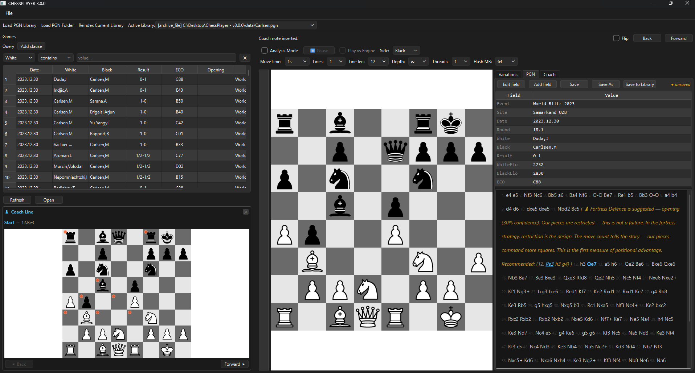
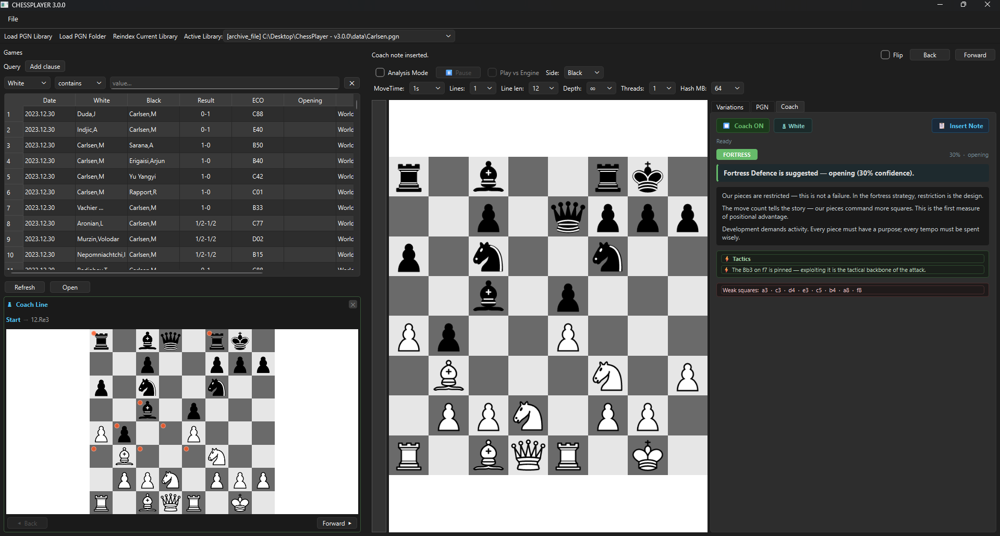
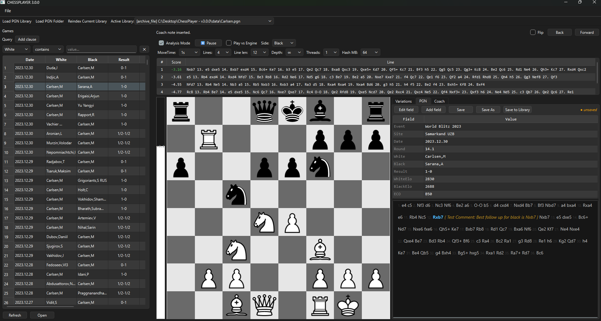

# ChessPlayer v3.0.0

A desktop chess analysis and coaching application for Windows. Browse large PGN game databases, analyse positions with a UCI engine, and receive structured strategic coaching — all running locally with no cloud dependency.

The coaching layer is actively evolving from a deterministic phrase-based system toward a fully trained neural network that understands 53 chess concepts by name, trained on millions of master positions and puzzle databases.

---

## Table of Contents

1. [Features](#features)
2. [Screenshots](#screenshots)
3. [Requirements](#requirements)
4. [Installation](#installation)
5. [Stockfish Setup](#stockfish-setup)
6. [Running the App](#running-the-app)
7. [Configuration](#configuration)
8. [Using the App](#using-the-app)
   - [Game Browser](#game-browser)
   - [Board & PGN Panel](#board--pgn-panel)
   - [Engine Panel](#engine-panel)
   - [Variations Panel](#variations-panel)
   - [Chess Coach](#chess-coach)
9. [Indexing PGN Files](#indexing-pgn-files)
10. [Project Architecture](#project-architecture)
    - [Directory Layout](#directory-layout)
    - [Module Map](#module-map)
    - [Dependency Rules](#dependency-rules)
    - [Signal Flow](#signal-flow)
11. [Coach Nimzowitsch — The Neural Network](#coach-nimzowitsch--the-neural-network)
    - [The 53 Concepts](#the-53-concepts)
    - [Model Architecture](#model-architecture)
    - [Training Pipeline](#training-pipeline)
    - [Data Sources](#data-sources)
    - [Algorithmic Detectors](#algorithmic-detectors)
    - [Roadmap](#roadmap)
12. [Training the Coach](#training-the-coach)
13. [The Deterministic Coach (Legacy)](#the-deterministic-coach-legacy)
14. [Database Schema](#database-schema)
15. [Configuration System](#configuration-system)
16. [Development Scripts](#development-scripts)
17. [Contributing](#contributing)

---

## Features

- **PGN Game Browser** — load any `.pgn` file or directory; filter by player, event, opening, date, and ECO code; paginated with lazy loading for databases of any size
- **Interactive Board** — drag-and-drop piece moves, full variation tree support, promote/demote variations, inline move comments
- **Engine Analysis** — Stockfish UCI integration with multi-PV evaluation, animated eval bar, and best-move arrows; runs on a background thread so the UI stays responsive
- **Continuation Statistics** — see how often a position arises in your loaded library and what the top continuations are, powered by an O(1) position-tree lookup
- **Chess Coach (Deterministic)** — Nimzowitsch-style strategic coaching: classifies each position into one of four strategies (Blitz, Flank, Fortress, Feint) and generates natural-language guidance assembled from a curated phrase database
- **Coach Nimzowitsch (Neural Network)** — a 53-class multi-label classifier trained to identify chess concepts by name directly from the board position and key move; trained on millions of master games, Lichess puzzles, and algorithmically-labelled positions
- **Offline-first** — all analysis, coaching, and database queries run locally

---

## Screenshots

*Screenshots will be updated when the ML coaching UI is integrated.*

**PGN Editor — game browser, interactive board, and engine analysis**



**Chess Coach — strategic coaching panel with Stockfish evaluation terms**



**Stockfish Integration — live evaluation bar and multi-PV analysis**



---

## Requirements

- **Python** 3.11 or 3.12
- **Windows** 10 / 11 (64-bit)
- **Stockfish** binary — see [Stockfish Setup](#stockfish-setup)

Python packages (installed via `pip`):

| Package | Version | Purpose |
|---|---|---|
| PySide6 | `>=6.8, <6.9` | GUI framework |
| python-chess | `>=1.11, <2.0` | Board logic, PGN parsing |
| PyYAML | `>=6.0.2, <7.0` | Configuration |
| torch | `>=2.0` | Neural network training and inference |
| numpy | `>=1.24` | Tensor utilities |

The `torch` and `numpy` packages are only required for the ML coaching pipeline (`src/chess_coach/ml/` and `tools/`). The main application runs without them if the coach ML components are not used.

---

## Installation

```powershell
# 1. Clone the repository
git clone https://github.com/TheSladTosser/ChessPlayer.git
cd "ChessPlayer - v3.0.0"

# 2. Create and activate a virtual environment (recommended)
python -m venv .venv
.venv\Scripts\Activate.ps1

# 3. Install dependencies
pip install -r requirements.txt
```

---

## Stockfish Setup

ChessPlayer does not bundle a Stockfish binary. You need to download it separately.

1. Go to [https://stockfishchess.org/download/](https://stockfishchess.org/download/) and download the Windows build for your CPU (AVX2 is recommended for modern hardware).
2. Extract the `.exe` to:
   ```
   assets/engines/stockfish-windows-x86-64-avx2/stockfish/stockfish-windows-x86-64-avx2.exe
   ```
3. If you use a different filename or path, update `engine.path` in `config/default.yaml` (or your user config) to point at the actual binary.

Any UCI-compatible engine will work — the path in config is the only coupling.

---

## Running the App

```powershell
cd src\chessplayer
python main.py
```

Or from the repo root:

```powershell
.\scripts\run_dev.ps1
```

**CLI flags:**

| Flag | Effect |
|---|---|
| *(none)* | Launch the GUI |
| `--index` | Rebuild the index for all configured sources, then exit |
| `--index-source <path>` | Index a single `.pgn` file or directory, then exit |

---

## Configuration

Configuration is a three-layer merge system.

| Layer | File | Purpose |
|---|---|---|
| 1 — Defaults | `config/default.yaml` | Canonical defaults, never edited at runtime |
| 2 — Dev overrides | `config/dev.yaml` | Local developer overrides (gitignored) |
| 3 — User overrides | `%APPDATA%\CHESSPLAYER\config.yaml` | Auto-saved user preferences |

Key settings in `config/default.yaml`:

```yaml
engine:
  enabled_on_start: false
  path: "assets/engines/stockfish-windows-x86-64-avx2/stockfish/stockfish-windows-x86-64-avx2.exe"

pgn_sources:
  active_source:
    type: "archive_file"
    path: "data/Carlsen.pgn"

coach:
  pgn_source: "data/Carlsen.pgn"
  phrase_db: "data/chess_coach.db"
  movetime_ms: 500
```

See [config/README_config.md](config/README_config.md) for the full schema.

---

## Using the App

### Game Browser

The left panel is the game archive. Filter by White, Black, Event, Site, ECO, or date range. Click any row to load that game onto the board. The table lazy-loads from SQLite so multi-gigabyte databases open instantly.

### Board & PGN Panel

- **Drag pieces** to make moves. Promotion prompts appear automatically.
- **Click moves in the PGN panel** to navigate to that ply.
- **Arrow keys** step forward/back through the mainline.
- Right-click a variation move to promote it to the mainline.
- Click the comment icon on a move to add or edit a PGN comment.

### Engine Panel

Toggle Stockfish on/off with the toolbar button. When active, shows centipawn score, animated eval bar, best move (highlighted on board), and principal variation lines.

### Variations Panel

Shows how often the current position appears in your loaded library and what moves were played from it, with win/draw/loss percentages. Uses a pre-built move tree for O(1) lookups.

### Chess Coach

The Coach tab analyses the current position and produces a strategic recommendation. The current live system is the deterministic coach (see [The Deterministic Coach](#the-deterministic-coach-legacy)). The neural network coach is in training and will be integrated into this panel.

---

## Indexing PGN Files

On first run, ChessPlayer indexes whatever PGN source is set in config. Indexing records a byte offset per game into SQLite — it does **not** copy game text into the database. A 4 GB `.pgn` file indexes in a few minutes and opens games in milliseconds.

To add a new source:

1. Drop your `.pgn` file into `data/`.
2. Update `pgn_sources.active_source.path` in `config/default.yaml`.
3. Run with `--index` or let auto-indexing run on next launch.

The move tree for continuation statistics is built separately and cached in `data/trees/` as a gzip-pickled file. It rebuilds automatically when the source changes.

---

## Project Architecture

### Directory Layout

```
ChessPlayer - v3.0.0/
|
+-- config/                     # YAML configuration (3-layer merge)
|   +-- default.yaml
|   +-- dev.yaml                # gitignored, local overrides
|   +-- README_config.md
|
+-- data/                       # Runtime data (gitignored)
|   +-- index.sqlite            # Game metadata + byte offsets
|   +-- chess_coach.db          # Deterministic coaching phrase database
|   +-- Carlsen.pgn             # Default game library
|   +-- Caissabase.pgn          # Master game database for ML training
|   +-- lichess_elite_2020-10.pgn
|   +-- lichess_db_puzzle.csv   # Lichess 6M puzzle database
|   +-- annotated_pgns/         # Annotated PGN training material
|   |   +-- Raw_pgn/            # Manually curated annotated games
|   |   +-- lichess_studies/    # Concept-organised Lichess studies
|   +-- training_raw.jsonl      # Assembled training dataset (generated)
|   +-- classifier_best.pt      # Best model checkpoint (generated)
|   +-- thresholds.json         # Per-class calibrated thresholds (generated)
|   +-- trees/                  # MoveTree cache files (.pkl.gz)
|
+-- assets/
|   +-- pieces/                 # PNG piece images
|   +-- engines/                # Place your Stockfish binary here
|   +-- scraping/               # Lichess data collection scripts
|   +-- ui.qss                  # Qt stylesheet
|
+-- src/
|   +-- chessplayer/            # Main application package
|   |   +-- app.py
|   |   +-- core/               # Chess state machine (no Qt)
|   |   +-- pgn/                # Database, indexer, move tree
|   |   +-- engine/             # UCI engine wrapper
|   |   +-- config/             # Config loader
|   |   +-- utils/
|   |   +-- ui/                 # All PySide6 widgets
|   |       +-- qml/BoardView.qml
|   |       +-- main_window/window.py
|   +-- chess_coach/            # Coaching backend
|       +-- core/               # Data types + strategy engine
|       +-- extractors/         # Six position-metric extractors
|       +-- strategies/         # Four strategy detectors
|       +-- database/           # Phrase DB, pattern matcher, PGN indexer
|       +-- ml/                 # Neural network coach
|           +-- concept_vocab.py    # 53 concept labels (stable, order matters)
|           +-- board_encoder.py    # FEN -> 909-dim tensor
|           +-- dataset.py          # JSONL loader + train/val/test split
|           +-- classifier.py       # MLP model definition
|           +-- train.py            # Training loop
|           +-- evaluate.py         # Threshold calibration + evaluation
|
+-- tools/                      # ML data pipeline scripts
|   +-- parse_annotated_pgn.py  # Extracts examples from annotated PGNs
|   +-- ingest_lichess_csv.py   # Processes Lichess 6M puzzle CSV
|   +-- ingest_game_database.py # Scans master game PGNs algorithmically
|   +-- label_positions.py      # 32 algorithmic concept detectors
|   +-- inspect_weights.py      # Post-training weight analysis
|
+-- retrain.ps1                 # Full pipeline: data -> train -> evaluate
+-- scripts/                    # run_dev.ps1, run_dev.sh, build_windows.ps1
```

### Module Map

| Module | Role |
|---|---|
| `core/pgn_edit.py` | Central chess controller — owns all move/navigation/annotation logic |
| `core/game_session.py` | `GameSession` — undo/redo wrapper around `chess.Board` |
| `pgn/store.py` | `PgnStore` — SQLite query layer for game metadata |
| `pgn/indexer.py` | PGN scanner, writes byte offsets to SQLite |
| `pgn/move_tree.py` | `MoveTree` — position-frequency tree for O(1) continuation lookup |
| `engine/uci_engine.py` | Stockfish subprocess controller, runs on QThread |
| `config/loader.py` | Three-layer config merge |
| `ui/main_window/window.py` | `MainWindow` — central coordinator, owns all signals |
| `chess_coach/ml/concept_vocab.py` | Canonical ordered list of all 53 concept labels |
| `chess_coach/ml/board_encoder.py` | `fen_to_tensor()` + `move_to_tensor()` + `COMBINED_SIZE` |
| `chess_coach/ml/classifier.py` | `ChessConceptClassifier` — 1024/512 MLP |
| `chess_coach/ml/train.py` | Training loop with macro F1 early stopping |
| `chess_coach/ml/evaluate.py` | Per-class threshold calibration, spot checks |
| `tools/label_positions.py` | `label_position(board)` — 32 algorithmic concept detectors |
| `tools/ingest_lichess_csv.py` | Lichess CSV ingestion with tag mapping + algo detection |
| `tools/ingest_game_database.py` | Master game database scanner, algo detection only |
| `tools/parse_annotated_pgn.py` | Keyword-based concept extraction from annotated PGNs |

### Dependency Rules

Qt is never imported outside of `ui/`.

```
ui/          -> core/, pgn/, engine/, config/, utils/
core/        -> (none - pure chess logic)
pgn/         -> utils/
engine/      -> (none - subprocess wrapper)
chess_coach/ -> core/ only
chess_coach/ml/ -> (none - standalone, numpy/torch only)
tools/       -> src/chess_coach/ml/ (concept_vocab, board_encoder)
```

### Signal Flow

```
User drags piece on QML board
  +-- BoardBridge.attemptMove(from_sq, to_sq)
       +-- PgnEditor.try_user_move()
            +-- PgnEditor updates board + PGN node
                 +-- bridge.moveMade.emit(san)
                      +-- MainWindow._on_position_changed()
                           +-- pgn_panel.refresh()
                           +-- variations_panel.refresh(prefix_uci)
                           +-- engine_panel.trigger_analysis()
                           +-- coachRequested.emit(fen, prefix_uci)
                                +-- MainWindow._on_coach_help_requested()
                                     +-- StrategyEngine.analyse(board, side)
                                          +-- CoachOutput -> CoachPanel
```

---

## Coach Nimzowitsch — The Neural Network

The central long-term project within ChessPlayer is **Coach Nimzowitsch**: a neural network trained to identify 53 chess concepts by name from a board position and the key move being played. This gives the coach a rich, human-readable vocabulary it can use to explain what's happening in a position — not just *what* Stockfish recommends but *why* it's good in terms a student can understand and remember.

### The 53 Concepts

The full concept vocabulary, in output-neuron order (fixed — adding new concepts must go at the end):

**Tactical**
`pin` · `fork` · `skewer` · `discovered_attack` · `deflection` · `decoy` · `overloading` · `zwischenzug` · `interference` · `clearance` · `back_rank` · `sacrifice` · `exchange_sacrifice` · `combination` · `mating_attack` · `trapped_piece`

**Piece concepts**
`outpost` · `blockade` · `bad_bishop` · `good_bishop` · `bishop_pair` · `piece_activity` · `battery` · `rook_seventh`

**Pawn structure**
`passed_pawn` · `isolated_pawn` · `backward_pawn` · `doubled_pawn` · `pawn_majority` · `pawn_chain` · `pawn_break` · `pawn_storm` · `pawn_weakness` · `pawn_island`

**King & squares**
`king_safety` · `king_activity` · `weak_square` · `open_file`

**Strategic**
`space_advantage` · `tempo` · `zugzwang` · `prophylaxis` · `minority_attack` · `simplification` · `fortification` · `coordination` · `color_complex` · `endgame_technique` · `opposition`

**Dynamic**
`counterplay` · `development_lead` · `attacking_chances` · `square_control`

### Model Architecture

```
Input: 909-dimensional vector
  - 781 board encoding  (piece placement, castling, en-passant, move counts, phase)
  - 128 move one-hot    (64 from-square + 64 to-square, the key move context)

Hidden layer 1:  Linear(909, 1024) -> BatchNorm -> ReLU -> Dropout(0.4)
Hidden layer 2:  Linear(1024, 512) -> BatchNorm -> ReLU -> Dropout(0.4)
Output:          Linear(512, 53)   -> per-class sigmoid (BCEWithLogitsLoss)

Parameters: ~1.49M
```

**Training details:**
- Loss: `BCEWithLogitsLoss` with per-class `pos_weight` clamped to (1.0, 50.0) to handle label imbalance
- Optimiser: AdamW, weight decay 5e-4, initial LR 1e-3 with cosine annealing
- Early stopping: macro F1 on validation set, patience 15 epochs
- Thresholds: calibrated per class on the validation set after training, saved to `data/thresholds.json`

**Why multi-label:** Most positions have multiple concepts simultaneously present. A position can be a `pin` + `battery` + `pawn_storm` + `king_safety` threat all at once. Single-label classification would lose this richness.

**Why the move feature:** The key move often determines the concept. A rook move to e7 could be `rook_seventh`, `battery`, or `clearance` depending on context. The 128-dim move one-hot gives the model the move being played alongside the static board, dramatically reducing ambiguity for tactical concepts.

### Training Pipeline

The full pipeline is orchestrated by `retrain.ps1`. Three data sources are assembled into `data/training_raw.jsonl` and then trained on:

```
1. parse_annotated_pgn.py  <-- data/annotated_pgns/
      |
      | Keyword matching on { comment } blocks.
      | Primary source for dynamic/meta concepts that require human prose
      | to identify: tempo, combination, fortification, coordination, etc.
      |
      v
2. ingest_lichess_csv.py   <-- data/lichess_db_puzzle.csv  (6M puzzles)
      |
      | Maps Lichess theme tags to our concept vocab.
      | ALSO runs all 32 algorithmic detectors on every puzzle position,
      | filling structural concepts Lichess doesn't explicitly tag.
      | Applies a per-concept cap (default 50k) to prevent common
      | structural concepts from drowning out rare tactical ones.
      |
      v
3. ingest_game_database.py <-- data/Caissabase.pgn, Carlsen.pgn, etc.
      |
      | Pure algorithmic detection on master game positions.
      | Samples every 5th move from each game.
      | Provides rich, unbiased positional examples for structural
      | concepts that puzzles under-represent.
      |
      v
data/training_raw.jsonl
      |
      v
train.py  -->  classifier_best.pt
      |
      v
evaluate.py  -->  thresholds.json
```

### Data Sources

| Source | Examples (approx) | Concepts covered |
|---|---|---|
| Annotated PGNs (`data/annotated_pgns/`) | ~50k labeled | Dynamic/meta concepts, all 53 via keyword |
| Lichess puzzle CSV (6M puzzles) | ~830k | 44+ concepts hit 50k cap |
| Master game databases (Caissabase etc.) | ~500k+ | Structural/strategic concepts |

### Algorithmic Detectors

`tools/label_positions.py` contains 32 position-level detectors that return concept labels directly from a `chess.Board` object. These fire on every position in the Lichess CSV and game database pipelines, providing high-precision labels at scale without requiring human annotation.

**Detectable from a single position:**

| Category | Concepts |
|---|---|
| Pawn structure | `passed_pawn` `isolated_pawn` `doubled_pawn` `pawn_island` `pawn_majority` `backward_pawn` `pawn_chain` `pawn_weakness` `pawn_storm` `minority_attack` |
| Piece quality | `bad_bishop` `good_bishop` `bishop_pair` `battery` `blockade` `outpost` `rook_seventh` `piece_activity` |
| King | `king_activity` `back_rank` `opposition` |
| Squares / files | `open_file` `weak_square` `square_control` `color_complex` `space_advantage` |
| Tactics | `pin` `fork` `skewer` `overloading` |
| Strategic | `development_lead` `endgame_technique` |

**Exchange sacrifice** is detected from the move rather than the position: if the key move (`move_uci`) is a rook capturing a bishop or knight, the position is labeled `exchange_sacrifice`.

**Not algorithmically detectable** (require move history or prose): `tempo`, `combination`, `zwischenzug`, `clearance`, `sacrifice`, `deflection`, `decoy`, `interference`, `discovered_attack`, `mating_attack`, `trapped_piece`, `counterplay`, `simplification`, `fortification`, `coordination`. These come exclusively from Lichess tags and annotated PGN keyword matching.

### Roadmap

The coach is being developed in three phases:

**Phase 1 — Current (MLP + static board features)**
- 909-dim input: board encoding + single move one-hot
- 1024/512 MLP with batch norm
- Realistic target: macro F1 ~0.55–0.65
- Structural and tactical concepts will be strong; dynamic/meta concepts will lag

**Phase 2 — Richer inputs (planned)**
- Attack maps: for each square, how many pieces of each side attack it
- Pawn structure features: passed pawn bitboards, pawn tension squares
- These additions will strengthen spatial concept detection without changing the model class

**Phase 3 — CNN + move history (planned)**
- Switch from MLP to CNN to model spatial piece relationships properly
- Concatenate the last N moves as additional input channels after the CNN
- Move history is essential for sequence-dependent concepts: `sacrifice`, `tempo`, `zwischenzug`, `combination`. These concepts are fundamentally about what happened before the current position, not just what the current position looks like
- Realistic target: macro F1 ~0.70–0.80

**Integration (planned)**
The ML classifier will sit alongside Stockfish, not compete with it. The intended flow: Stockfish identifies the best move; the concept classifier labels the current position and the move being played; the Nimzowitsch phrase database generates natural-language explanation keyed to those concept labels. The coach's job is to explain *why* Stockfish's recommendation is good in human chess vocabulary.

---

## Training the Coach

Prerequisites: `torch`, `numpy`, `python-chess` installed. The Lichess puzzle CSV and at least one master game database must be in `data/`.

**Full pipeline (from repo root):**

```powershell
.\retrain.ps1
```

The script runs all six stages in order, stopping on any failure:

| Step | Script | Input | Output |
|---|---|---|---|
| 1 | `parse_annotated_pgn.py` | `data/annotated_pgns/` | `training_raw.jsonl` |
| 2 | `ingest_lichess_csv.py` | `data/lichess_db_puzzle.csv` | appended to `training_raw.jsonl` |
| 3 | `ingest_game_database.py` | `data/Caissabase.pgn` etc. | appended to `training_raw.jsonl` |
| 4 | `train.py` | `training_raw.jsonl` | `classifier_best.pt` |
| 5 | `evaluate.py` | `classifier_best.pt` | `thresholds.json` + evaluation report |
| 6 | `inspect_weights.py` | `classifier_best.pt` | Weight norm report per concept |

**Running individual steps:**

```powershell
# Dry run: see label distribution from Lichess CSV without writing
python tools/ingest_lichess_csv.py --input data/lichess_db_puzzle.csv --count-only --limit 50000

# Scan specific game databases for under-represented concepts only
python tools/ingest_game_database.py --input data/Carlsen.pgn --target battery,blockade,minority_attack --append

# Training only (if training_raw.jsonl already exists)
python -m src.chess_coach.ml.train

# Evaluate + calibrate thresholds on existing checkpoint
python -m src.chess_coach.ml.evaluate
```

**JSONL format** — each training example:
```json
{
  "fen":      "r1bqkb1r/pppp1ppp/2n2n2/4p3/2B1P3/5N2/PPPP1PPP/RNBQK2R w KQkq - 4 4",
  "move_uci": "f3g5",
  "themes":   ["pin", "fork", "battery"],
  "comment":  "The knight move creates a fork threat while exploiting the pin...",
  "phase":    "opening"
}
```

---

## The Deterministic Coach (Legacy)

The original coaching system remains the live implementation while the neural network is being trained. It is fully functional and is the system currently running in the application.

### How it works

```
chess.Board
    |
    v
1. Extractors (6 modules) -> list[MetricSignal]
    |
    v
2. Phase filter -> re-weight signals for opening/middlegame/endgame
    |
    v
3. Strategy scoring -> four detectors score 0.0-1.0 each
    |                  blitz / flank / fortress / feint
    v
4. Conflict resolver -> 5-rule priority cascade picks primary + confidence
    |
    v
5. Plan recommender -> selects weakness squares and move flags
    |
    v
6. GM precedents -> PatternMatcher queries coach_positions table
    |
    v
7. Narrator -> slot-fills phrase templates -> CoachOutput
```

### The four strategies

| Strategy | What it means |
|---|---|
| **Blitz** | Direct assault on an exposed king — concentrate attackers, open lines, strike before defence consolidates |
| **Flank** | Positional squeeze — restrict mobility, occupy outposts, cramp the opponent until the position collapses |
| **Fortress** | Blockade defence — when objectively worse, seal open files, fix the pawn structure, hold the wall |
| **Feint** | Wing misdirection — hold tension deliberately, bait a commitment to one wing, then switch |

A strategy must score above **0.65** to be considered "fired." Two strategies within 0.08 of each other are both surfaced with the tension between them noted. The Feint gate prevents misdirection from being named as primary without GM pattern database confirmation.

### Extractors

| Extractor | Signals |
|---|---|
| `king_safety.py` | `king_exposure`, `sacrifice_delta` |
| `space_control.py` | `space_delta_queenside`, `space_delta_kingside` |
| `piece_mobility.py` | `piece_mobility_ratio` |
| `pawn_structure.py` | `pawn_fixedness`, `weak_pawns`, `passed_pawn` |
| `material_balance.py` | `material_imbalance`, `eval_deficit` |
| `tactic_scanner.py` | `tactic_pin`, `tactic_fork`, `tactic_skewer`, `tactic_discovery` |

### Phrase database

`data/chess_coach.db` contains phrase templates attributed to chapters of *My System* (Aaron Nimzowitsch, 1925). The narrator fills five placeholders (`{square}`, `{file}`, `{piece}`, `{side}`, `{target}`) from the live `MetricSignal` data at query time. No extractor ever generates English; no narrator ever generates scores. This separation is a hard architectural rule.

---

## Database Schema

### `data/index.sqlite` — game index

```sql
CREATE TABLE sources (
    source_id    INTEGER PRIMARY KEY,
    type         TEXT,           -- 'archive_file' or 'directory'
    path         TEXT
);

CREATE TABLE games (
    game_id      INTEGER PRIMARY KEY,
    source_id    INTEGER,
    pgn_path     TEXT,
    offset_bytes INTEGER,        -- byte offset of this game in the file
    white        TEXT,
    black        TEXT,
    result       TEXT,
    event        TEXT,
    site         TEXT,
    date         TEXT,
    eco          TEXT,
    opening      TEXT
);
```

Full game text is never duplicated. `PgnStore.open_game_pgn_text(game_id)` seeks to `offset_bytes` and parses one game on demand.

### `data/trees/<sha1>.pkl.gz` — move tree cache

A gzip-pickled `MoveTree` keyed by the source file's SHA-1. Position keys are the first four FEN fields so transpositions hash to the same node.

### `data/training_raw.jsonl` — ML training dataset

Generated by the data pipeline. One JSON object per line in the format described in [Training the Coach](#training-the-coach). Not committed to git.

### `data/thresholds.json` — per-class thresholds

Generated by `evaluate.py` after training. Maps each of the 53 concept labels to a calibrated sigmoid threshold (0.0–1.0) that maximises F1 on the validation set.

---

## Configuration System

The merge runs at startup:

```
default.yaml  --------+
dev.yaml  ------------+-- deep_merge() -> live config dict
%APPDATA%\CHESSPLAYER\config.yaml  --+
```

User overrides write back automatically when the active source changes. See [config/README_config.md](config/README_config.md) for the full schema.

---

## Development Scripts

| Script | Purpose |
|---|---|
| `retrain.ps1` | Full ML pipeline: annotated PGNs -> Lichess CSV -> game databases -> train -> evaluate -> inspect |
| `scripts/run_dev.ps1` | Launch the app from the correct working directory (Windows PowerShell) |
| `scripts/run_dev.sh` | Same, for bash |
| `scripts/build_windows.ps1` | Package the app for distribution |

---

## Contributing

- Module boundaries and the no-Qt-outside-ui rule are load-bearing — keep them.
- **Concept vocab (`concept_vocab.py`) is append-only.** Adding a concept in the middle shifts every output neuron index and invalidates all saved checkpoints. New concepts go at the end only.
- New algorithmic detectors go in `tools/label_positions.py` and must be added to both `DETECTABLE_CONCEPTS` and the `label_position()` call loop.
- New coaching phrases go in the phrase DB seed scripts keyed by `strategy/metric/severity/fragment_type`.
- New extractors go in `src/chess_coach/extractors/` and must be added to the strategy engine's extractor list.
- Run the coach test suite before pushing: `pytest src/chess_coach/tests/`.
